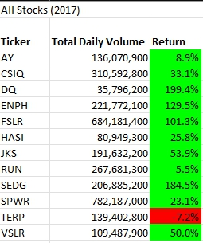
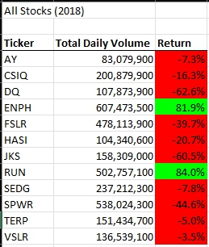
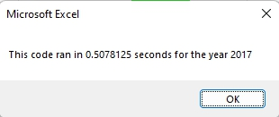
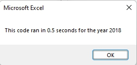
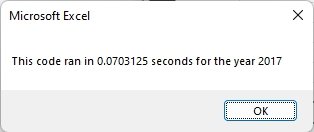
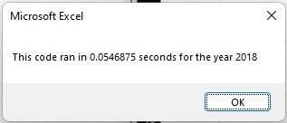

# Stock Analysis

## Overview of Project
The purpose of this analysis is to compare how refactoring the code affects the efficiency in a large set of data. In particular, this code will calculate the total daily volume and return of a number of stocks in a large data set using arrays and `for` loops. 

## Results

### Stock Performance



As shown in above images, compared to 2017 where only 1 stock showed a negative return, all but 2 stocks in 2018 have showed negative returns. This illustrates that the stock market in 2018 in general has not performed very well.

### Script Performance
Module script was built using `for` loops with values stored as variables, 
```
   Dim startingPrice As Single
   Dim endingPrice As Single
```
Loop went through each ticker to calculate volume, starting price, and ending price, then immediately printed out each value into the worksheet. As the program ran through each loop, values for volume, starting price, and ending prices have been reset and given another value. This code took about 0.5 seconds for each year, as shown in below screenshots.




Similar to module script, challenge code was written with `for` loops, but with arrays. 
```
    Dim tickerVolumes(11) As Long
    Dim tickerStartingPrices(11) As Single
    Dim tickerEndingPrices(11) As Single
```
As the program went through each loop, all values (volume, starting price, and ending price) for each ticker were stored into arrays.Then another `for` loop was used to print the stored values onto the worksheet. The analysis for each year took just over 0.07 seconds, which proved to be a lot more efficient than the original script.





## Summary

### General Advantages and Disadvantage of Refactoring Code
One advanatage to refactoring code is the improvement in efficiency. Refactoring code allows programmers to improve current logic and therefore the performance. As time progresses, programming languages develop and adds new features as well. Refactoring allows programmers to utilize the updates or just simpy write more concise and easy-to-read code to improve the efficiency. Disadvantages of refactoring code are that it can be time-consuming and may introduce bugs. When refactoring a code, it takes time for programmers to read and understand the current code structure then to re-write them. This can be costly for the business manaagement as time is equivalent to money. Also, while refacotoring the code, it opens doors for bugs, as with any programming, whether you're writing a new or refactoring one.

### Challenge Specific Pros and Cons
The refactored code in VBA challenge has significantly improved the performance, cutting the execution time to nearly 10% of the original code. This is a significant improvement, allowing users to run larger data in a shorter amount of time. With the original code, `for` loop overwrote or reset the values for volume, starting price, and ending price each time. On the contrary, the refactored code stored all the values in array, positioned with ticker index. This allowed the system to be able to recall the values, which is why the print code block was written in another `for` loop outside of first loop to calculate and store the values. However, as with general refactoring, it was time consuming to re-evaluate how to structure the code and to write another logic to carry out the same yet more efficient performance. 
